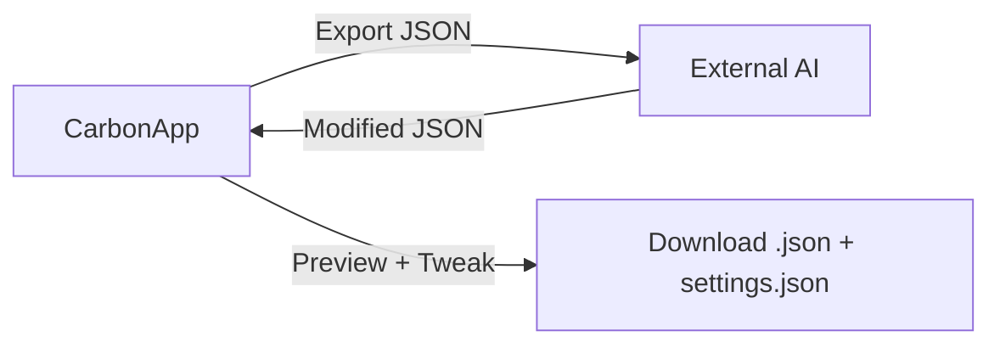

# CarbonApp — VS Code Theme Studio

A React-based web application for creating, previewing, and exporting custom VS Code color themes. Designed to work in tandem with external AI tools (ChatGPT, Claude, etc.) for rapid theme generation.

## Concept

Building a VS Code theme entirely by hand in JSON is tedious — there are over 100 color keys and dozens of token scopes. CarbonApp solves this with a visual editor that previews every change in real time, paired with an AI-friendly export/import loop for bulk generation.



## Workflow

| Step | Action | Where |
|------|--------|-------|
| 1 | Tweak colors or start from defaults | CarbonApp |
| 2 | Export complete theme JSON | CarbonApp → download |
| 3 | Paste JSON into AI tool with instructions | ChatGPT / Claude / etc. |
| 4 | AI returns modified JSON | — |
| 5 | Import JSON back into CarbonApp | CarbonApp → Import button |
| 6 | Preview theme in Monaco editor mockup | CarbonApp |
| 7 | Final tweaks via color pickers | CarbonApp |
| 8 | Download theme + settings files | CarbonApp → Download |

## AI Prompt Example

```
I have this VS Code theme JSON. I want you to modify it:
- Make the editor background a deep navy blue (#0a0e14)
- Change strings to bright orange (#ff8c00)
- Make the sidebar darker than the editor
- Use warm yellows for keywords
- Keep everything else consistent with these changes

Here is the theme JSON:
{ ... }
```

## Tech Stack

| Layer | Technology |
|-------|-----------|
| Framework | React 18 + Vite |
| Code Editor | @monaco-editor/react (dual instance) |
| State Management | React Context + useReducer |
| Styling | Plain CSS, Inter font family, dark-themed UI |
| Color Picking | Native `<input type="color">` |
| File Export | Blob + URL.createObjectURL |

## Key Features

- **Live VS Code Mockup**: Full window preview — Title Bar, Activity Bar, Sidebar, Tabs, Editor, Status Bar — all bound to theme colors
- **Monaco Editor Preview**: Real syntax highlighting using the theme's token color rules
- **~110 Workbench Color Keys**: 11 categorized sections covering every VS Code UI zone
- **~28 Token Scopes**: Syntax highlighting for comment, keyword, string, number, function, class, variable, and more
- **Import/Export Loop**: Export complete JSON → modify with AI → import back → see changes instantly
- **Companion Settings Export**: Downloads `settings.json` snippet with font family, size, and ligatures
- **Font Selector**: Built-in list of popular coding fonts with live preview
- **Dark/Light Type Toggle**: Switch between theme base types
- **No Backend**: 100% client-side — all processing happens in the browser

## Reference

- [Full Theme JSON](./FULL-THEME-JSON.md) — Complete VS Code theme JSON with all color keys and token rules. Use this as the export format and AI prompt payload.
- [Application Architecture](./ARCHITECTURE.md) — Component tree, data flow, state shape, file map, Monaco integration details.
